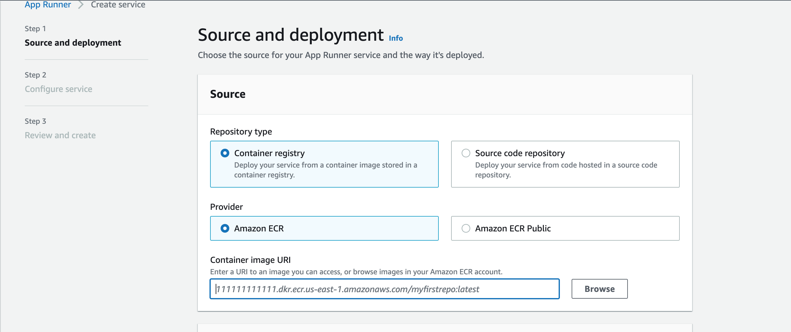
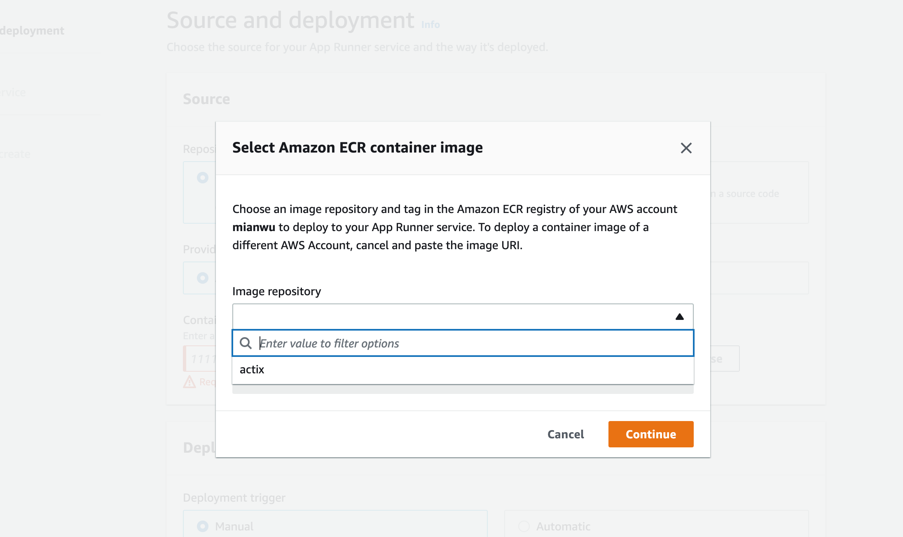
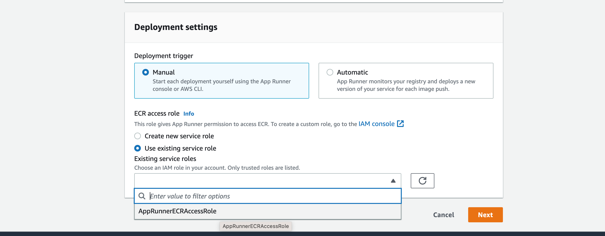

# Copilot is sooooooooo cool! It helps me build a containerized actix microservice!!

# [Continuous Delivery of Rust Actix to ECR and AWS App Runner](https://nogibjj.github.io/rust-tutorial/chapter_3.html#continuous-delivery-of-rust-actix-to-ecr-and-aws-app-runner)

## How? -> 3 steps
* 1. -> to make it locally deployed
```bash
make format
make lint
make run
```
* 2. -> to containerize it (make sure docker is properly configured and started)

```bash
make build # build an image out of the Dockerfile
make rundocker # launch the container from the image
```
* 3. -> to deploy a Continuous Delivery of the web service using AWS ECR and App Runner

1. Set up AWS Cloud9 Rust env with [rustup](https://rustup.rs/), git config global settings, etc.
2. [Generate an SSH public key](https://docs.github.com/en/authentication/connecting-to-github-with-ssh/generating-a-new-ssh-key-and-adding-it-to-the-ssh-agent) and configure it to your github account (if you want to later develop on your cloud env using push/pull stuffs)
3. Clone the repo and `make format` and `make lint` to make sure everything works fine.
4. Go and create an ECR (Elastic Container Registry) 

5. Run the 4 commands in your Cloud9 env to create a docker image for your ECR, commands provided under the "View push commands" after selecting your ECR entry.
    ```bash
    aws ecr get-login-password --region us-east-1 | docker login --username AWS --password-stdin [aws-account-id].dkr.ecr.us-east-1.amazonaws.com # login
    docker build -t [your ECR name] . # build docker image
    docker tag [ecr-name]:latest [aws-accout-id].dkr.ecr.us-east-1.amazonaws.com/[ecr-name]:latest # tag the image
    docker push [aws-account-id].dkr.ecr.us-east-1.amazonaws.com/actix:latest # push the image to your resporitory
    ```
6. Go and create an App Runner service by selecting the created container image url



7. Wait for completion of the deployment.
8. Open up the app url! (mine is https://wnqfmhu9xj.us-east-1.awsapprunner.com/rock)
    
## Note
The dev env is AWS Cloud9. If you directly run the codes from this Codespaces, it might not work. But it should work as long as you have your docker and rust env set up in your place!

## References
* [containerized-actix-continuous-delivery-to-aws-apprunner](https://github.com/nogibjj/rust-mlops-template/blob/main/README.md#containerized-actix-continuous-delivery-to-aws-app-runner)
* [webdocker-github-code-example](https://github.com/nogibjj/rust-mlops-template/tree/main/webdocker)
* [install-docker-on-debian](https://www.fosslinux.com/49959/install-docker-on-debian.html)