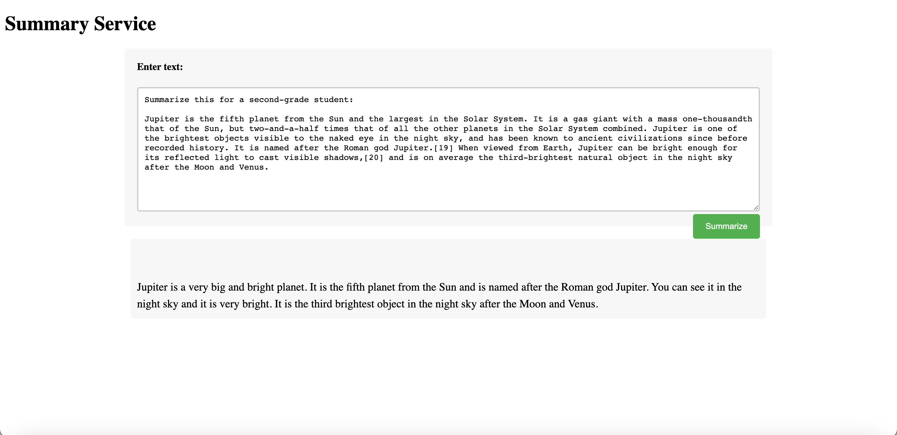

# A Rust Summarizer-for-2nd-grader Service with OpenAI API 

Translates difficult text into simpler concepts.

The service has been deployed to duke virtual machine. Access it from [here](http://vcm-30756.vm.duke.edu:8080/)!


> Sample input:
 
> Summarize this for a second-grade student:

> Jupiter is the fifth planet from the Sun and the largest in the Solar System. It is a gas giant with a mass one-thousandth that of the Sun, but two-and-a-half times that of all the other planets in the Solar System combined. Jupiter is one of the brightest objects visible to the naked eye in the night sky, and has been known to ancient civilizations since before recorded history. It is named after the Roman god Jupiter.[19] When viewed from Earth, Jupiter can be bright enough for its reflected light to cast visible shadows,[20] and is on average the third-brightest natural object in the night sky after the Moon and Venus.



### Usage
- Get your development API Key from [here](https://platform.openai.com/account/api-keys)

- Set it as the value of "OPENAI_API_KEY" in your local environment as an exported variable. e.g.,
```bash
export OPENAI_API_KEY="xxx"
```

- Run the program
```bash
cargo run
```
- Launch http://127.0.0.1:8080 in the browser

### Containerize
- Create a Dockerfile and deploy the service to AWS APP Runner. See instructions from [here](https://github.com/nogibjj/rust-world-spr23/tree/main/actix-containerized-microservice-wk3/actixdocker#this-is-to-build-an-image-out-of-the-dockerfile).
    - Build container out of the Docker image: run `make build --build-arg OPENAI_API_KEY="xxx"`
    - Clean build: `docker build --no-cache --build-arg OPENAI_API_KEY="xxx" -t summarize .` or run `make build-no-cache --build-arg OPENAI_API_KEY="xxx"`

### References
- [OpenAI-examples](https://platform.openai.com/examples)
- [OpenAI-Summarize-playground](https://platform.openai.com/playground/p/default-summarize?model=text-davinci-003)

### Use "screen" CLI to leave the program running on the virtual machine

To run a program with the command `cargo run` in a Linux virtual machine through the macOS Terminal, expose it to the machine's 0.0.0.0:8080 port, and leave the terminal without affecting the running program, follow these steps:

- Reserver from [here](https://vcm.duke.edu)
- `ssh user@ip_address`
- install screen CLI: `sudo apt-get update && sudo apt-get install screen`
- start a new screen session: `screen -S mysession`
- `cd path/to/your/rust/project`
- remember to add the OPENAI_API_KEY to environment
- run `cargo run` to start the service
- Detach from the screen session by pressing Ctrl-A followed by D. This will keep the program running in the background even if you close the terminal or log out of the SSH session.
- to reattach to the screen session later, use `screen -r mysession`

### Useful tips
- Check whether a port has been used: `sudo lsof -i :8080 -sTCP:LISTEN`

### Appendix - troubleshoots of the deployment on the duke Linux machine
- Be sure to include a correct OPENAI_API_KEY in every environment that you are running the service!
- "error: failed to run custom build command for `openssl-sys v0.9.84`"
    - run `sudo apt-get update`
    - run `sudo apt-get install pkg-config libssl-dev`
    - run `export OPENSSL_DIR=/usr/local/ssl`

- If it still occurs
    - run `find / -type d -name "openssl" 2>/dev/null`
    - Output:
        - > /usr/include/x86_64-linux-gnu/openssl
        - > /usr/include/openssl
        - > /usr/lib/python3/dist-packages/cryptography/hazmat/backends/openssl
        - > /usr/lib/python3/dist-packages/cryptography/hazmat/bindings/openssl
        - > /usr/share/doc/openssl
    - run `export OPENSSL_INCLUDE_DIR=/usr/include/openssl`
    - run `export OPENSSL_LIB_DIR=/usr/lib/x86_64-linux-gnu`
    - run `export OPENSSL_DIR=/usr`
    - now re-run `cargo run`
