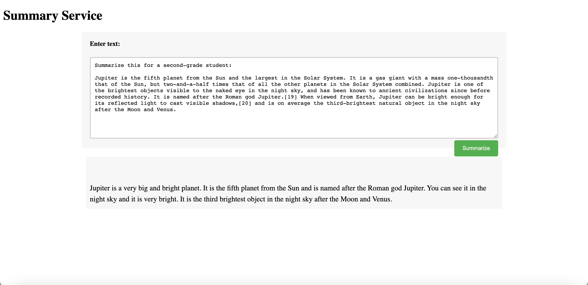

# A Rust Summarize Service with OpenAI API 

The service has been deployed to duke virtual machine. Access it from [here](http://vcm-30756.vm.duke.edu:8989/)!



### Usage
- Get your development API Key from [here](https://platform.openai.com/account/api-keys)

- Set it as the value of "OPENAI_API_KEY" in your local environment as an exported variable. e.g.,
```bash
export OPENAI_API_KEY="xxx"
```

- Run the program
```bash
cargo run
```
- Launch http://127.0.0.1:8080 in the browser

- Create a Dockerfile and deploy the service to AWS APP Runner. See instructions from [here](https://github.com/nogibjj/rust-world-spr23/tree/main/actix-containerized-microservice-wk3/actixdocker#this-is-to-build-an-image-out-of-the-dockerfile).
    - `docker build --no-cache --build-arg OPENAI_API_KEY="xxx" -t summarize .`
### References
- [OpenAI-examples](https://platform.openai.com/examples)
- [OpenAI-Summarize-playground](https://platform.openai.com/playground/p/default-summarize?model=text-davinci-003)
