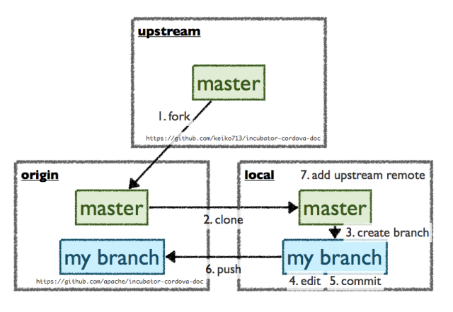

# A tool to sync between upstream, forked origin and local.

# Why is it useful?

- It's convenient that Github has a "Sync fork/Update stream" option, but some (e.g. gitlab) doesn't. So, you might need something to help you make your remote origin in sync with the upstream.



#
## Precondition

- You have
    - a remote origin that was forked from an upstream source
    - a local repo that was cloned from your remote origin.

## Usage
- Now suppose your local repo path is `PATH`, your remote branch is `main` (in gitlab, it's `master`), and the upstream path is `UPSTREAM`
- You could then run this program with cmd right in current directory:
```{bash}
cargo run -- syncfork --path PATH -- UPSTREAM main
```
- For example, your are in your local directory "~/rust-world-spr23", (and you have added your remote origin "git@github.com:[your github id here]/rust-world-spr23"), and the upstream is "https://github.com/mianwu515/rust-world-spr23.git" (HTTPS url version, or you can use SSH url version here, which might be "git@github.com:mianwu515/rust-world-spr23.git")
- Then the cmd would be
```
cargo run -- syncfork --path "~/rust-world-spr23" -- "git@github.com:mianwu515/rust-world-spr23.git" main
```
- Done! Your local and remote origin have been updated with the upstream!

## References
- [rust_cmd_lib](https://github.com/rust-shell-script/rust_cmd_lib)
- [rust-cli-example](https://github.com/nogibjj/hello-rust)
- [macro cmd_lib::run_cmd](https://docs.rs/cmd_lib/0.7.4/cmd_lib/macro.run_cmd.html)
- [cmd_lib](https://crates.io/crates/cmd_lib)
