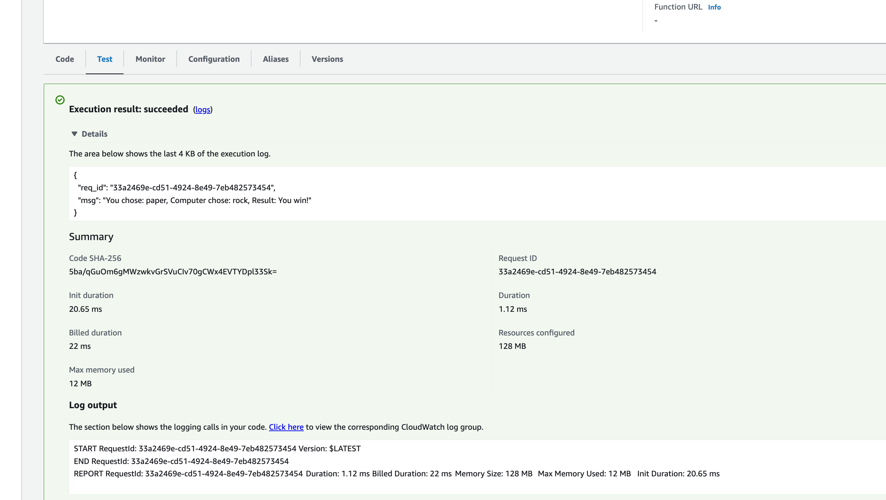

# Deployed an AWS Lambda Function with a mini Rust CLI game.

## How
```bash
# cargo install cargo-lambda (run if you have never installed it)
cargo lambda new my-first-lambda-function

# write code..

# rustup target add x86_64-unknown-linux-musl (run if you have never installed it)
cargo build --release --target x86_64-unknown-linux-musl
target/x86_64-unknown-linux-musl/release/myfirstlambdafunction ./bootstrap
zip lambda.zip bootstrap
# I then use the AWS Lambda console to submit the zip file
```

## Test
```json
Input
{
  "choice": "paper"
}

Output
{
  "req_id": "33a2469e-cd51-4924-8e49-7eb482573454",
  "msg": "You chose: paper, Computer chose: rock, Result: You win!"
}
```



## References
* [Cargo-Lambda](https://crates.io/crates/cargo-lambda)
* [install-cargo-lambda](https://pypi.org/project/cargo-lambda/0.10.0rc1/)
* [aws-sdk-for-rust-lambda](https://docs.aws.amazon.com/sdk-for-rust/latest/dg/lambda.html)
* [aws-lambda-rust-runtime](https://github.com/awslabs/aws-lambda-rust-runtime#aws-cli)
* [marco-polo-lambda](https://github.com/nogibjj/rust-mlops-template/tree/main/marco-polo-lambda)
