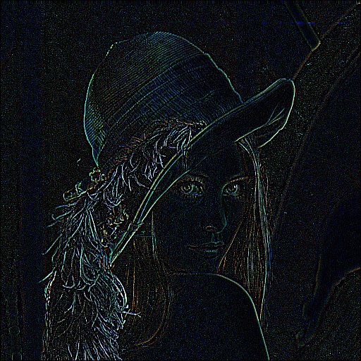

# Edge detection - Rust Image




## How 

```bash
make format
```

```bash
make lint 
## The Clippy tool is a collection of lints to analyze your code so you can catch common mistakes and improve your Rust code.
```

```bash
make run
```

```bash
make release
```

## Usage
```bash
make run
```

## References
* [image-rs](https://github.com/image-rs/image)
* [crate-image](https://crates.io/crates/image)