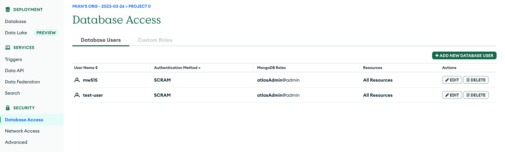
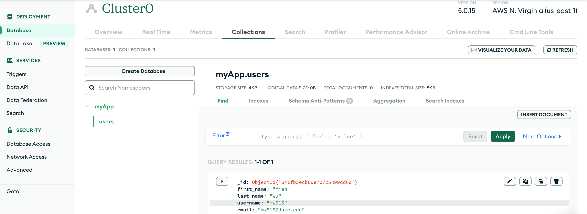

# Rust-Actix-MongoDB-User-Management-System

- Follow the example [here](https://github.com/actix/examples/tree/master/databases/mongodb).

- Use web::Form ([here](https://github.com/nogibjj/rust-world-spr23/blob/main/week9/src/main.rs#L16) in the code) as content type for POST method

### Setup MongoDB 
- [Sign in to your MongoDB account](https://account.mongodb.com/account/login?nds=true)
- Create a cluster
- Add a new database_user by setting a username and passcode for it

- Add an environment variable in your development machine, and name it MONGODB_URI, assigning it with your _connection string_ (Remember to replace the username and password). Here is an example bash command:
    ```bash
    export MONGODB_URI="mongodb+srv://<username>:<password>@cluster0.uymuwvl.mongodb.net/?retryWrites=true&w=majority"
    ```
- Now the code can fetch your _connection string_ from your environment and connect your application with your database cluster

### Use case
```bash
cargo run

curl -v -X POST -H "Content-Type: application/x-www-form-urlencoded" -d "first_name=Mian&last_name=Wu&username=mw515&email=mw515@duke.edu" http://127.0.0.1:8080/add_user
```

### Output
```bash
*   Trying 127.0.0.1:8080...
* Connected to 127.0.0.1 (127.0.0.1) port 8080 (#0)
> POST /add_user HTTP/1.1
> Host: 127.0.0.1:8080
> User-Agent: curl/7.86.0
> Accept: */*
> Content-Type: application/x-www-form-urlencoded
> Content-Length: 64
> 
* Mark bundle as not supporting multiuse
< HTTP/1.1 200 OK
< content-length: 10
< date: Sun, 26 Mar 2023 03:03:08 GMT
< 
* Connection #0 to host 127.0.0.1 left intact
user added
```

Now if we go to Collections in the cluster, we should be able to find a new data entry added:



### Supplementary Note
* If using web::Json as payload, the POST method can be used as below:
```bash
curl -v -X POST -H "Content-Type: application/json" -d '{"first_name":"Mian","last_name":"Wu","username":"mw515","email":"mw515@duke.edu"}' http://127.0.0.1:8080/add_user
```

### Reference
* [Rust-Actix-MongoDB-Example](https://github.com/actix/examples/tree/master/databases/mongodb)
